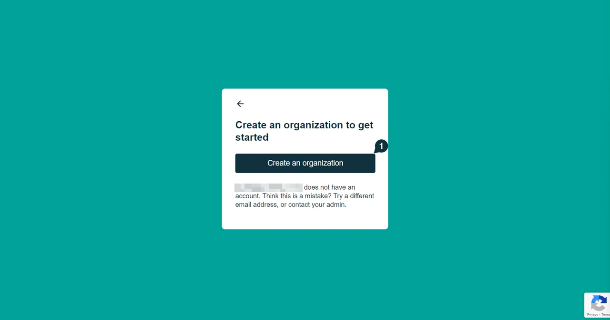
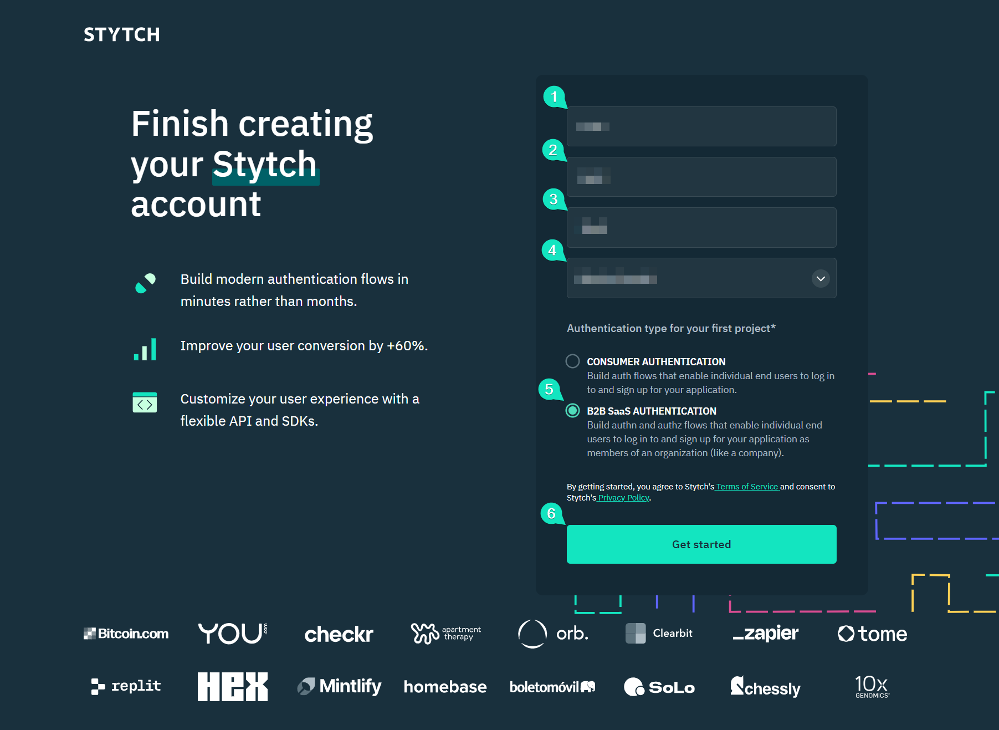
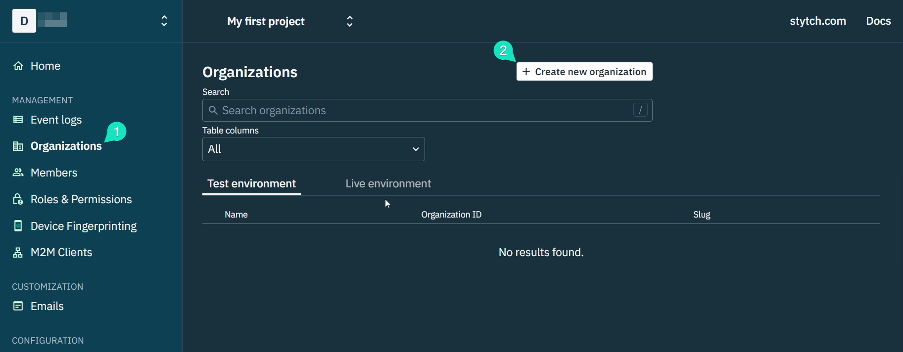
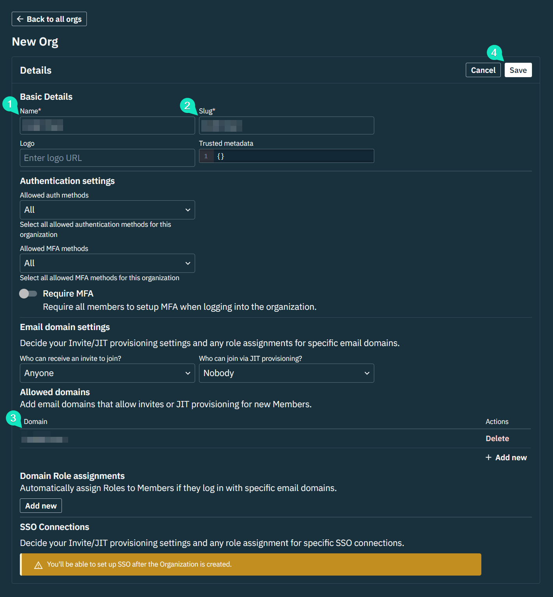
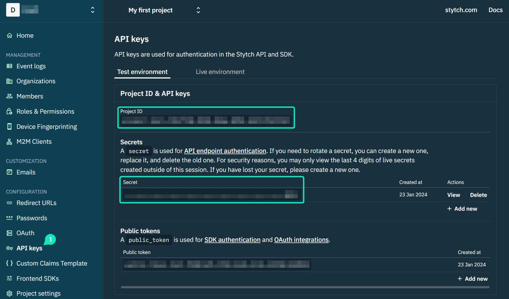
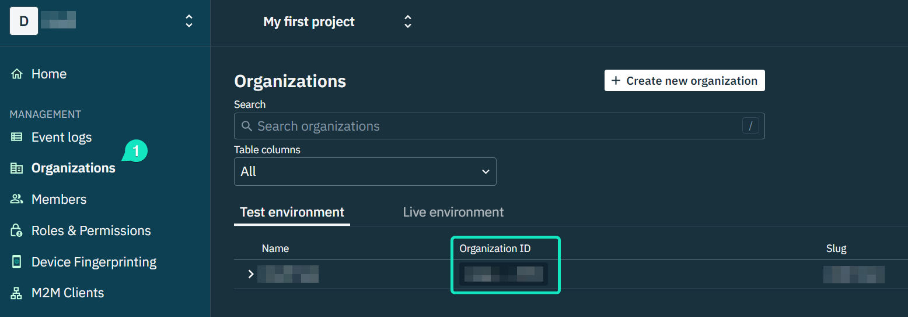
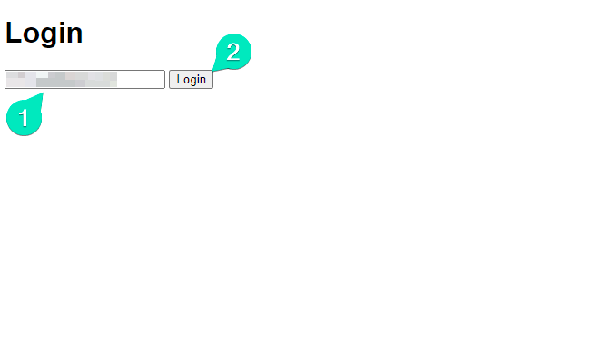
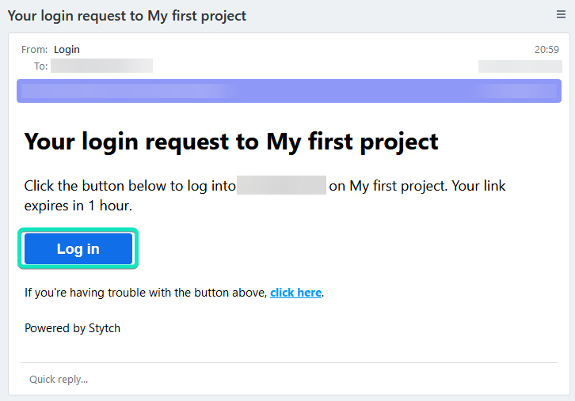

# Stytch JWT and Session Authorization Demo App

This demo application shows how you can combine JWT and Session Authorization in a Node.js application using Stytch.

## Getting Started

Follow the steps in the sections below to get this demo application running in your own environment:

1. Clone the repository
2. Create a Stytch B2B Authentication Project
3. Add Stytch Configuration Details to Your Node.js App
4. Run the App

### 1. Clone the repository

First clone the repository by running the following command in your terminal:

```shell
git clone https://github.com/ivankahl/stytch-jwt-session-demo.git
```

Navigate into the cloned folder using the following terminal command:

```shell
cd stytch-jwt-session-demo
```

Once inside, create a new `.env` in the directory and paste the following snippet:

```
PORT=3000
BASE_URL=http://localhost:3000
```

Before you can run the project, make sure to set up a Stytch account and configure the demo app to use it in the next few sections.

### 2. Create a Stych B2B Authentication Project

Before running the project locally, you'll need to set up a free Stytch account and create a B2B Authentication project. If you don't have a Stytch account yet, you can [create one for free](https://stytch.com/b2b). When you log in for the first time, Stytch will prompt you to create an organization before accessing the dashboard:



After you click **Create an organization**, you'll see a form appear asking you to finish creating your new account. Complete the form and select **B2B SaaS AUTHENTICATION** when it asks for your authentication type. Then click **Get started** to finish creating your new project:



B2B authentication lets you create organizations for companies that use your product. You can control who can sign up to join the companies based on their email address. Typically, you'd automate the configuration of organizations in code so that your users can set up their organizations. But for this demonstration, you'll manually set up your organization in the **Stytch B2B Dashboard**.

On the left pane of the **Stytch Dashboard**, click on **Organizations** and then click the **Create new organization** button:



On the screen that appears, enter the name and a slug for the new organization. Under the **Allowed domains** heading, add your business email's domain. This lets you authenticate using your business email address. Finally, click **Save** to create the organization:



### 3. Add Stytch Configuration Details to Your Node.js App

At this point, you're ready to integrate your Node.js app with Stytch using the Stytch SDK. However, before you can do this, you need to obtain your project ID and secret so Node.js can access your Stytch project.

On the left menu, click on **API keys** and jot down the **Project ID** and **Secret** that appear:



You'll add these to your project configuration later.

In this demo, you'll also store the ID of the organization you created in the previous step in your app's configuration. Navigate to **Organizations** on the left menu and copy the **Organization ID** on the screen that appears:



Back on your Node.js project, open your `.env` file and add the Stytch configuration values you retrieved. You also need to store the base URL for your app and the desired user session duration for Stytch authentication links to work. Your `.env` file should now look like this:

```plaintext
PORT=3000
BASE_URL=http://localhost:3000
STYTCH_PROJECT_ID="<YOUR_STYTCH_PROJECT_ID>"
STYTCH_SECRET="<YOUR_STYTCH_SECRET>"
STYTCH_ORGANIZATION_ID="<YOUR_STYTCH_ORGANIZATION_ID>"
SESSION_DURATION_MINUTES=5
```

### 4. Run the App

You're ready to run the app. Open your terminal and run the following command:

```shell
node server.js
```

Navigate to `https://localhost:3000` (if you've changed the port number, use that one). Enter your email address in the login form that appears and click **Login**:



Stytch then sends to the specified email address an email with a link you must click to log in:



After clicking the **Log in** button, Stytch authenticates your session and redirects you back to the Node.js app. The Node.js app creates a cookie for the session and redirects you to the `/protected` page, which is now accessible because you've logged in:


